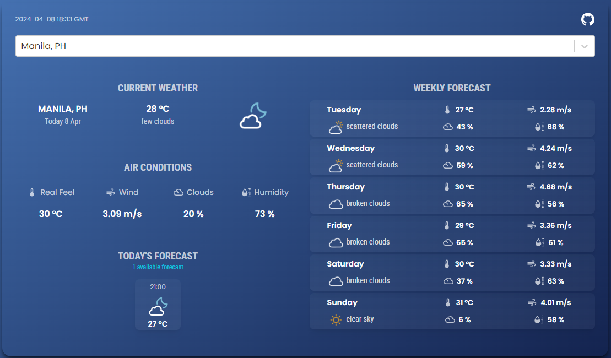

# Weather Dashboard

This is a weather dashboard application built with React that allows users to search for weather information by city. The application displays current weather conditions, a 5-day forecast, and historical weather data for the searched location.

## Features

- Search for weather information by city.
- View current weather conditions, including temperature, humidity, etc.
- View a 5-day forecast.
- View historical weather data for the searched location.

## Technology Used

- React
- Redux Toolkit
- React Router
- OpenWeatherMap API
- CSS (or SCSS) for styling

## How to Run the Project

Follow the steps below to set up and run the application locally:

### Installation

1. Clone the repository to your local machine:

   ```bash
   git clone https://github.com/bryancanlas/Weather-Dashboard.git
2. Navigate to the project directory and install dependencies::

   ```bash
   cd Weather-Dashboard

   npm install
3. Set up your OpenWeatherMap API key:
   - Sign up for an account on the OpenWeatherMap platform.

   - Generate an API key

   - Replace `'YOUR_API_KEY'` in `services/weatherService.js` file with your actual API key.

4. Run the Application locally:

   ```bash
   npm start
5. Visit http://localhost:3000 in your web browser to access the application.

### Usage

1. Access the application in your web browser at `http://localhost:3000`.

2. Enter a city name in the search bar to view weather information for that city.

3. Navigate between the current weather, forecast, and historical data views using the tabs or sections provided.

## Acknowledgements

- The OpenWeatherMap API is used for fetching weather data.

- The application assumes a basic familiarity with React and Redux.

## Contributing

Contributions are welcome! If you have any ideas for improvements or new features, feel free to submit a pull request.

## License

This project is licensed under the MIT License. See the [LICENSE](LICENSE) file for details.


### Thank you for your consideration!

